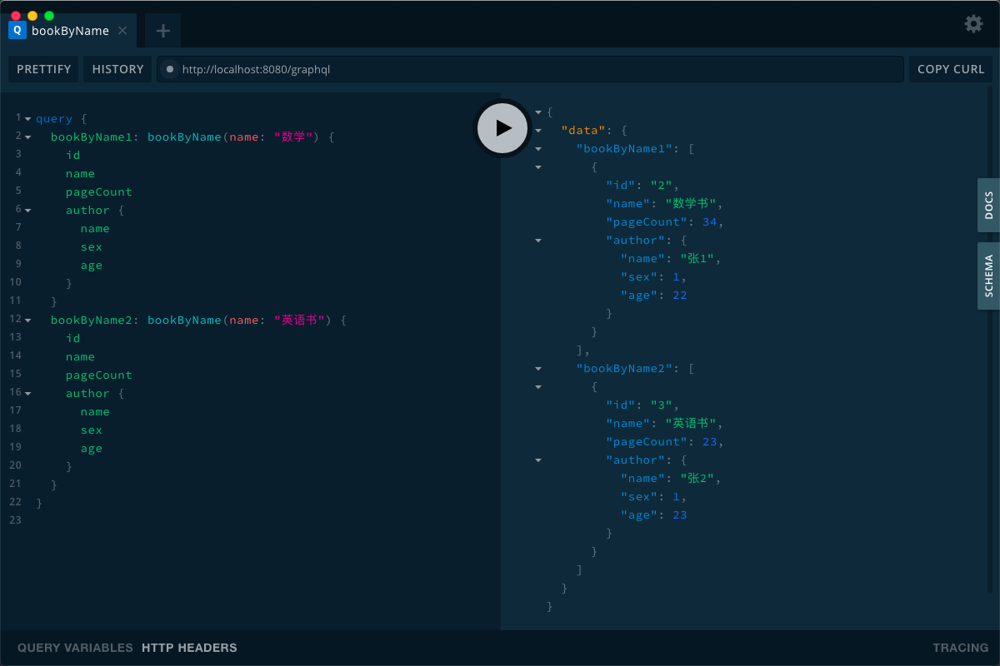

## graphQl demo

> springboot+mybatis+graphQl demo

参考了 https://www.graphql-java.com/tutorials/getting-started-with-spring-boot/ 改成了数据库模式




### 启动web
```web
http://localhost:8080/graphql
```

### 打开GraphQl Playground 测试

1. 单个查询
    ```graphql
    query {
      bookByName(name: "书") {
        id
        name
        pageCount
        author {
          name
          sex
          age
        }
      }
    }
    
    ```
2. 多个查询
    ```graphql
    query {
      bookByName1: bookByName(name: "数学") {
        id
        name
        pageCount
        author {
          name
          sex
          age
        }
      }
      bookByName2: bookByName(name: "英语书") {
        id
        name
        pageCount
        author {
          name
          age
        }
      }
    }
    ```